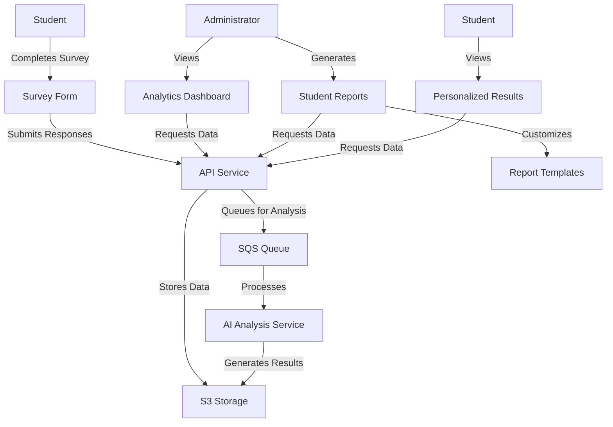

# Design Document: AI Capability Assessment Enhancement

## Overview

This design document outlines the technical approach for enhancing the AI Capability Assessment System. The enhancements focus on improving analytics, reporting, and personalization capabilities while building upon the existing system architecture. The design aims to provide a more comprehensive and insightful assessment experience for both administrators and students.

## Architecture

The enhanced system will maintain the current architecture while adding new components and extending existing ones. The architecture consists of:

### Frontend Components
- **React Components**: Enhanced UI components for analytics, reporting, and student feedback
- **State Management**: Extended Zustand stores for managing analytics and reporting data
- **Visualization Layer**: New charting components using Chart.js and Recharts

### Backend Services
- **API Services**: Extended API endpoints for analytics and reporting
- **AI Analysis Service**: Enhanced AI analysis capabilities with more personalized insights
- **S3 Integration**: Continued use of S3 for data storage with improved organization
- **SQS Service**: Enhanced message queue for asynchronous processing of reports and analytics

### Data Flow


## Components and Interfaces

### 1. Enhanced Analytics Dashboard

#### Component Structure
- **AnalyticsDashboard**: Main container component
- **CategoryDistributionChart**: Visualizes score distributions by category
- **DemographicBreakdown**: Shows scores by demographic factors
- **TrendAnalysis**: Displays score changes over time
- **ComparisonTool**: Allows comparison between groups
- **AnalyticsFilters**: Provides filtering options
- **ExportControls**: Handles report generation and export

#### Interface
```typescript
interface AnalyticsFilters {
  workspaceId?: string;
  surveyId?: string;
  dateRange?: [Date, Date];
  demographics?: {
    education?: string[];
    major?: string[];
    ageGroup?: string[];
  };
}

interface CategoryScore {
  category: string;
  averageScore: number;
  distribution: {
    score: number;
    count: number;
  }[];
}

interface DemographicBreakdown {
  factor: string;
  groups: {
    name: string;
    averageScore: number;
    categoryScores: {
      category: string;
      score: number;
    }[];
  }[];
}

interface TrendData {
  timePoints: string[];
  series: {
    category: string;
    scores: number[];
  }[];
}
```

### 2. Enhanced Student Report Generator

#### Component Structure
- **ReportGenerator**: Main container component
- **StudentSelector**: Interface for selecting students
- **ReportPreview**: Preview of the generated report
- **CategoryBreakdown**: Visual breakdown of category scores
- **StrengthsWeaknesses**: Display of strengths and areas for improvement
- **RecommendationSection**: Customizable recommendations
- **ReportCustomizer**: Interface for customizing report sections
- **ExportOptions**: Controls for exporting and sharing

#### Interface
```typescript
interface StudentReport {
  studentId: string;
  studentName: string;
  studentInfo: {
    organization: string;
    age: number;
    email: string;
    education: string;
    major: string;
  };
  surveyId: string;
  surveyTitle: string;
  submissionDate: string;
  overallScore: number;
  categoryScores: {
    category: string;
    score: number;
    maxScore: number;
    percentage: number;
  }[];
  strengths: {
    category: string;
    description: string;
    relatedQuestions: string[];
  }[];
  improvementAreas: {
    category: string;
    description: string;
    relatedQuestions: string[];
  }[];
  recommendations: {
    type: 'immediate' | 'learning' | 'development';
    description: string;
    resources?: {
      title: string;
      url?: string;
      description?: string;
    }[];
  }[];
  summary: string;
}

interface ReportTemplate {
  id: string;
  name: string;
  sections: {
    id: string;
    type: 'header' | 'category-scores' | 'strengths' | 'improvements' | 'recommendations' | 'summary';
    title: string;
    enabled: boolean;
    customContent?: string;
  }[];
  branding: {
    logo?: string;
    institutionName?: string;
    primaryColor?: string;
    secondaryColor?: string;
  };
}
```

### 3. Group Comparison Tool

#### Component Structure
- **ComparisonTool**: Main container component
- **GroupSelector**: Interface for defining groups
- **ComparisonChart**: Visual comparison of groups
- **StatisticalAnalysis**: Display of statistical differences
- **CategoryComparison**: Comparison by category
- **ComparisonExport**: Export comparison results

#### Interface
```typescript
interface ComparisonGroup {
  id: string;
  name: string;
  filters: {
    surveyIds?: string[];
    dateRange?: [Date, Date];
    demographics?: {
      education?: string[];
      major?: string[];
      ageGroup?: string[];
      organization?: string[];
    };
  };
}

interface ComparisonResult {
  groups: {
    id: string;
    name: string;
    sampleSize: number;
    overallScore: {
      average: number;
      median: number;
      stdDev: number;
    };
    categoryScores: {
      category: string;
      average: number;
      median: number;
      stdDev: number;
    }[];
  }[];
  significantDifferences: {
    category: string;
    groupA: string;
    groupB: string;
    difference: number;
    pValue: number;
    isSignificant: boolean;
  }[];
}
```

### 4. Enhanced Student Results View

#### Component Structure
- **EnhancedResultsView**: Main container component
- **CategoryScoreBreakdown**: Visual breakdown of scores
- **StrengthsDisplay**: Detailed display of strengths
- **ImprovementAreasDisplay**: Detailed areas for improvement
- **PersonalizedRecommendations**: Tailored recommendations
- **CompetencyProfile**: Visual representation of competency
- **ReportDownload**: PDF download functionality

#### Interface
```typescript
interface StudentResults {
  studentName: string;
  surveyTitle: string;
  submissionDate: string;
  overallScore: number;
  competencyLevel: 'beginner' | 'intermediate' | 'advanced' | 'expert';
  categoryScores: {
    category: string;
    score: number;
    maxScore: number;
    percentage: number;
    level: 'low' | 'moderate' | 'high';
  }[];
  strengths: {
    category: string;
    description: string;
    score: number;
  }[];
  improvementAreas: {
    category: string;
    description: string;
    score: number;
  }[];
  recommendations: {
    description: string;
    resources?: {
      title: string;
      url?: string;
      description?: string;
    }[];
  }[];
}
```

### 5. AI Analysis Customization

#### Component Structure
- **AICustomizationPanel**: Main container component
- **CategoryWeightEditor**: Interface for adjusting category weights
- **ThresholdEditor**: Interface for setting threshold values
- **TemplateEditor**: Interface for editing report templates
- **BrandingCustomizer**: Interface for customizing branding
- **PreviewGenerator**: Preview of customized reports

#### Interface
```typescript
interface AIAnalysisSettings {
  categoryWeights: {
    category: string;
    weight: number;
  }[];
  thresholds: {
    competencyLevel: {
      beginner: number;
      intermediate: number;
      advanced: number;
      expert: number;
    };
    strengthThreshold: number;
    improvementThreshold: number;
  };
  reportCustomization: {
    defaultTemplate: string;
    templates: ReportTemplate[];
  };
}
```

## Data Models

### Enhanced Survey Response Model
```typescript
interface EnhancedSurveyResponse {
  id: string;
  surveyId: string;
  workspaceId: string;
  studentInfo: {
    name: string;
    organization: string;
    age: number;
    email: string;
    education: string;
    major: string;
  };
  answers: {
    questionId: string;
    questionText: string;
    category: string;
    score: number;
  }[];
  submittedAt: string;
  completionTime?: number;
  overallScore: number;
  categoryScores: {
    category: string;
    score: number;
    maxScore: number;
    percentage: number;
  }[];
  aiAnalysis: {
    strengths: string[];
    improvementAreas: string[];
    recommendations: {
      immediateActions: string[];
      learningResources: string[];
      skillDevelopmentPath: string;
    };
    summary: string;
    detailedReport: {
      currentPosition: string;
      growthPotential: string;
      keyInsights: string[];
    };
    analyzedAt: string;
  };
}
```

### Analytics Data Model
```typescript
interface AnalyticsData {
  overview: {
    totalResponses: number;
    averageScore: number;
    categoryAverages: {
      category: string;
      average: number;
    }[];
  };
  demographics: {
    byEducation: {
      level: string;
      count: number;
      averageScore: number;
    }[];
    byMajor: {
      major: string;
      count: number;
      averageScore: number;
    }[];
    byAgeGroup: {
      group: string;
      count: number;
      averageScore: number;
    }[];
    byOrganization: {
      organization: string;
      count: number;
      averageScore: number;
    }[];
  };
  trends: {
    timePoints: string[];
    overallScores: number[];
    categoryScores: {
      category: string;
      scores: number[];
    }[];
  };
}
```

### Report Template Model
```typescript
interface ReportTemplate {
  id: string;
  name: string;
  createdAt: string;
  updatedAt: string;
  sections: {
    id: string;
    type: string;
    title: string;
    enabled: boolean;
    order: number;
    customContent?: string;
    customStyle?: {
      [key: string]: string;
    };
  }[];
  branding: {
    logo?: string;
    institutionName?: string;
    primaryColor?: string;
    secondaryColor?: string;
    fontFamily?: string;
  };
}
```

## Error Handling

### Frontend Error Handling
- Implement comprehensive error boundaries around major components
- Display user-friendly error messages with recovery options
- Log detailed error information for debugging
- Implement retry mechanisms for API calls and data loading

### API Error Handling
- Return standardized error responses with appropriate HTTP status codes
- Include detailed error messages and error codes
- Implement proper validation of request data
- Handle authentication and authorization errors gracefully

### S3 and SQS Error Handling
- Implement retry mechanisms for failed uploads and downloads
- Handle timeout errors with appropriate fallback strategies
- Provide clear error messages for storage-related issues
- Implement dead-letter queues for failed SQS messages

## Testing Strategy

### Unit Testing
- Test individual components and functions in isolation
- Use Jest for JavaScript/TypeScript testing
- Implement comprehensive test coverage for utility functions and data transformations
- Mock external dependencies and API calls

### Integration Testing
- Test interactions between components
- Verify data flow between frontend and backend
- Test API endpoints with realistic data
- Verify S3 and SQS integrations

### End-to-End Testing
- Use Cypress for end-to-end testing
- Test complete user flows for administrators and students
- Verify report generation and export functionality
- Test analytics dashboard with various filters and data sets

### Performance Testing
- Test system performance with large datasets
- Verify response times for analytics queries
- Test report generation with complex templates
- Ensure smooth rendering of charts and visualizations

### Accessibility Testing
- Ensure all new components meet WCAG 2.1 AA standards
- Test keyboard navigation and screen reader compatibility
- Verify color contrast and text readability
- Test with various assistive technologies